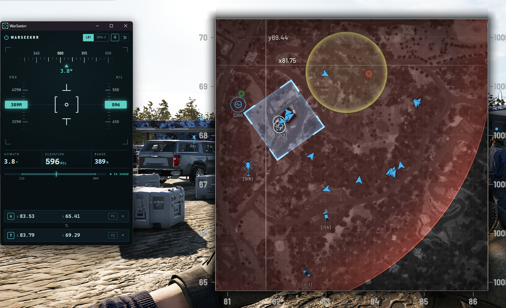

# WarSeekrr

Mortar and artillery calculator for WARDOGS that reads coordinates straight off
the in-game map.



Open the map, put the crosshair on your mortar and press **F1**. Put it on the
target and press **F2**. WarSeekrr reads the `x`/`y` readout next to the
crosshair and shows azimuth, elevation (MIL) and distance.

## Download

Grab the latest build from [Releases](../../releases):

- `WarSeekrr-<version>-setup.exe` installer
- `WarSeekrr-<version>-portable.exe` single executable, no install

Builds are unsigned, so Windows SmartScreen may warn on first launch
(More info → Run anyway). Run the game in borderless or windowed mode.

## Features

- Global hotkeys, configurable in settings
- L81 Mortar and SPH-2 (low and high arc)
- Manual entry and paste (`x92.92 y111.29`)
- Always-on-top window
- Capture preview for troubleshooting a failed read

## How it works

```
hotkey → cursor position → capture box beside crosshair → binarise, split lines
       → Windows OCR (several passes, voted) → parse x/y → firing solution
```

Grid coordinates are 100 m per unit. Azimuth is measured from north, and MIL is
interpolated from the in-game firing tables.

## Privacy

WarSeekrr only looks at the screen when you press a hotkey, and only at a small
box beside the map crosshair. It does not read or modify game memory, inject
into the game, or make any network connections. Everything runs locally.

WarSeekrr is an unofficial fan tool. It is not affiliated with or endorsed by
the WARDOGS developers. Check the game's rules on third-party tools before use.

## License

Free to download and use for noncommercial purposes. The source is published
for transparency under the [PolyForm Strict License 1.0.0](LICENSE): you may
read and run it, but not modify or redistribute it. Contributions are not
accepted.

---

Created and maintained by [Cataclaw](https://github.com/Cataclaw). © 2026 Cataclaw.
